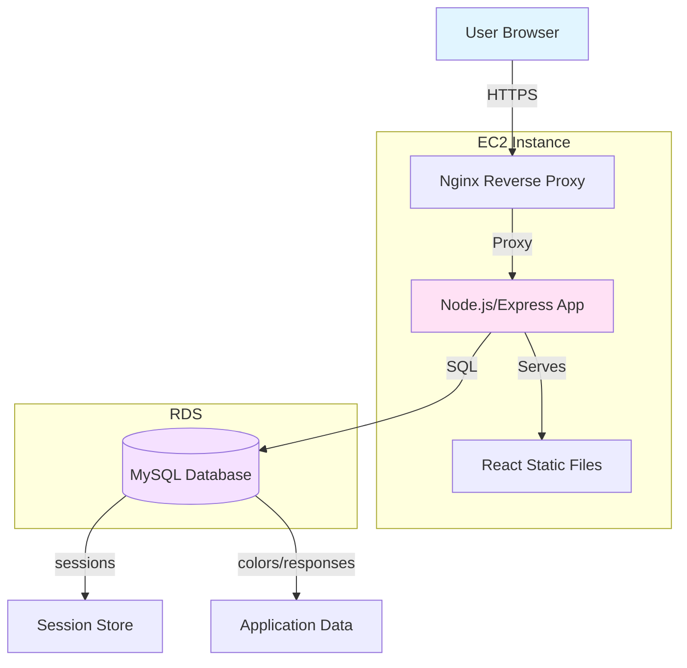
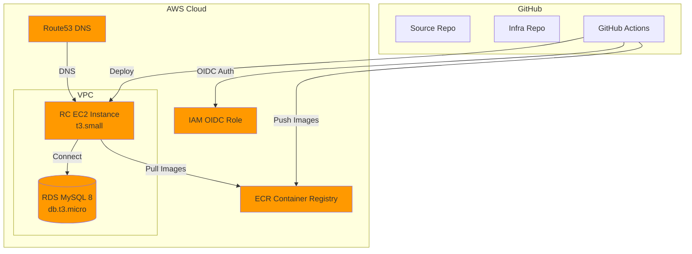
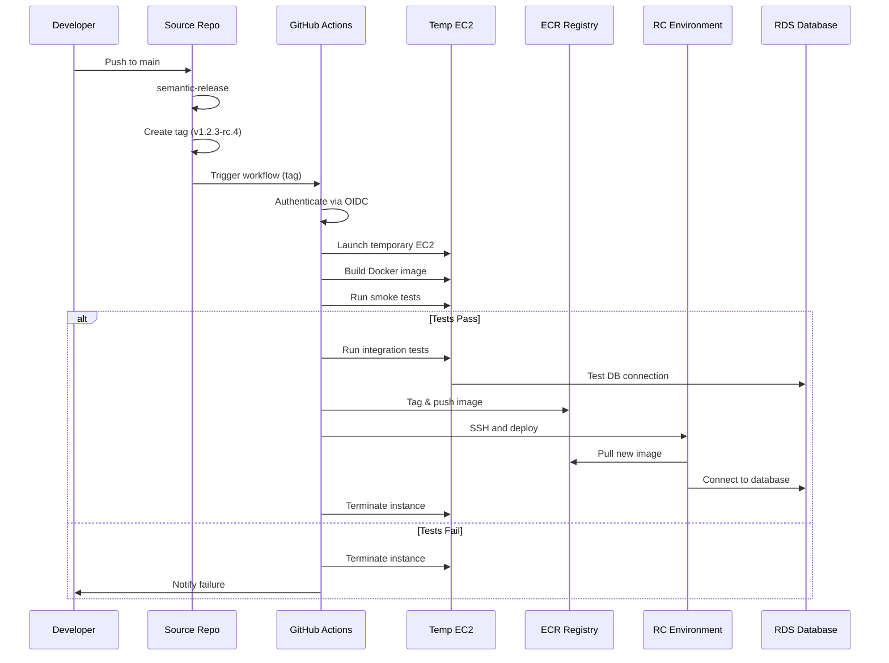
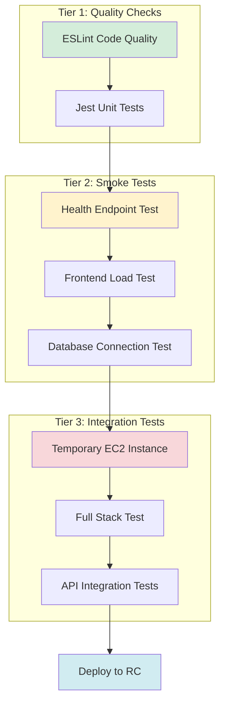

# Building a Cloud-Native Color Perception App

**A Complete DevOps Implementation**

March 8, 2026

---

# Agenda

- System Overview
- Technology Stack
- Architecture
- Infrastructure Components
- CI/CD Pipeline
- Testing Strategy
- Implementation Journey
- Future Enhancements

---

# What We Built

**Color Perception Study Application**

A Single Page Application for studying how people classify colors across different native languages.

**Key Features:**
- Unlimited RGB color exploration (16.7 million possible colors)
- Real-time personal and global statistics
- Interactive 3D color space visualization with Three.js
- Session persistence across classifications
- First-to-classify tracking

**User Flow:**
Language Selection → Classify Colors → View Stats → Explore 3D Cube

---

# Technology Stack

**Frontend:**
- React 19 with Vite build tooling
- React Three Fiber for 3D visualization
- React Router for client-side routing

**Backend:**
- Express.js REST API
- Node.js 20
- MySQL session store with express-session

**Database:**
- MySQL 8 (RDS)

**Container:**
- Docker with multi-stage builds
- docker-compose for local development

**Cloud:**
- AWS (EC2, RDS, ECR)

**CI/CD:**
- GitHub Actions with OIDC authentication
- Semantic versioning with semantic-release

**Testing:**
- Jest for unit tests
- ESLint for code quality
- Custom integration tests on temporary EC2

---

# System Architecture

**Monolithic Container Approach:**
- Single container serves both API and static frontend
- Simplified deployment and debugging
- Perfect for tutorial clarity

---

# AWS Infrastructure

**Components:**
- EC2: Application hosting (RC environment)
- RDS: Managed MySQL database
- ECR: Private Docker image registry
- IAM: OIDC-based authentication (no long-lived credentials)
- Security Groups: Network isolation and access control

---

# Dual Repository Strategy

**Why Two Repositories?**

**Source Repository (devops-spring26-midterm-source):**
- Application code (frontend + backend)
- Dockerfile and docker-compose
- Semantic versioning with tags
- Repository dispatch triggers on new releases

**Infrastructure Repository (devops-spring26-midterm-infra):**
- GitHub Actions deployment workflows
- AWS deployment scripts
- OIDC permissions and IAM configuration
- Environment-specific configurations

**Benefits:**
- Separation of concerns (code vs deployment)
- Different access controls
- Clear CI/CD boundaries
- Semantic versioning drives deployments

---

# CI/CD Pipeline Flow

**Flow:** Push → Semantic Tag → Build → Test → Deploy

---

# Three-Tier Testing Strategy

**Tier 1:** Code quality gates (fast feedback)
**Tier 2:** Container validation (runs on build instance)
**Tier 3:** Full integration (temporary infrastructure, ~$0.01 per run)

---

# What I Built in GitHub

**OIDC Authentication Setup:**
- Configured AWS IAM identity provider
- No long-lived access keys required
- Temporary credentials per workflow run

**5+ GitHub Actions Workflows:**
- Quality checks (lint + unit tests)
- Build and test (smoke tests)
- Integration testing (temporary EC2)
- RC deployment (semantic versioning)
- Production deployment (manual trigger)

**Semantic-release Configuration:**
- Conventional commits parsing
- Automatic version bumping
- Changelog generation
- Git tag creation

**Automation:**
- Repository dispatch triggers
- Branch protection rules
- Secrets management (RDS credentials, SSH keys)

---

# What I Built in AWS

**EC2 Instances:**
- RC environment (t3.small, Amazon Linux 2023)
- Elastic IP for stable DNS
- Docker + docker-compose installed
- Nginx reverse proxy with SSL

**RDS MySQL Database:**
- db.t3.micro instance
- Production-grade configuration
- Automated backups (7-day retention)
- Security group isolation

**ECR Container Registry:**
- Private Docker image storage
- Semantic version tagging
- Image scanning enabled

**IAM Roles:**
- OIDC trust policy for GitHub
- Least-privilege permissions
- EC2, ECR, and RDS access

**Security Groups:**
- Network isolation
- RDS accessible only from EC2
- HTTPS/SSH properly configured

**All Infrastructure Deployed via GitHub Actions!**

---

# Key Implementation Wins

**Session Persistence Fix:**
- Added `app.set('trust proxy', 1)` for nginx proxy
- Fixed session cookie handling behind reverse proxy

**Unlimited RGB Color Generation:**
- Migrated from 20 pre-defined colors to 16.7 million possibilities
- Random RGB generation with collision detection
- Database schema refactoring (responses table now self-contained)

**Safe Database Migrations:**
- Non-destructive schema changes
- Backfill existing data from colors table
- Comprehensive rollback scripts

**Temporary EC2 Integration Testing:**
- Launch instance → test → terminate
- Quality gate before deployment
- Cost-efficient (~$0.01 per test run)

**Zero-Downtime Deployments:**
- Docker image pull and swap
- Health checks before traffic routing
- Quick rollback capability

---

# Challenges & Solutions

**Challenge:** Session persistence broken
**Solution:** Added `app.set('trust proxy', 1)` to trust nginx reverse proxy for secure cookies

---

**Challenge:** Semantic-release not triggering deployment workflows
**Solution:** Used Personal Access Token (PAT) instead of GITHUB_TOKEN for cross-repo triggers

---

**Challenge:** Database migration safety concerns
**Solution:** Implemented safe migration strategy with validation steps and comprehensive rollback scripts

---

**Challenge:** Need to test before deployment without standing infrastructure
**Solution:** Temporary EC2 instances for integration tests - launch, test, terminate (~$0.01 per run)

---

**Challenge:** Managing secrets securely
**Solution:** GitHub Secrets + OIDC authentication (no long-lived AWS credentials)

---

# What's Next - Production Ready

**Phase 1: Production Environment**
- Dedicated production EC2 instances (separate from RC)
- Production RDS database with Multi-AZ
- Separate ECR tags (rc vs prod)
- Blue-green deployment capability

**Phase 2: High Availability**
- Application Load Balancer (ALB)
- Auto Scaling Groups (minimum 2 instances)
- Multi-AZ RDS deployment
- Health checks and automatic failover
- Session storage in ElastiCache (Redis)

**Phase 3: Disaster Recovery**
- Cross-region RDS read replicas
- Automated backup testing
- RTO/RPO targets defined
- Runbook documentation

---

# What's Next - Advanced Features

**Performance Optimization:**
- CloudFront CDN for global content distribution
- Route53 latency-based routing
- ElastiCache for session and data caching
- S3 for static asset hosting
- Database query optimization and indexing

**Reliability Enhancements:**
- Blue-green deployment strategy
- Automated rollback on failure detection
- Database read replicas for scaling
- Circuit breakers for external dependencies
- Graceful degradation patterns

**Observability:**
- Structured logging with correlation IDs
- Distributed tracing
- Real-time error tracking
- Performance metrics and SLOs

---

# What's Next - Operations

**Monitoring & Observability:**
- CloudWatch dashboards and alarms
- Application Performance Monitoring (APM)
- Log aggregation and analysis
- Custom metrics for business KPIs
- Alert routing (PagerDuty/Slack)
- On-call rotation setup

**Security Hardening:**
- AWS WAF for DDoS protection
- SSL/TLS certificates via ACM
- Regular security scanning (Snyk, Dependabot)
- Automated patching pipelines
- Secret rotation automation
- Compliance auditing (SOC2, GDPR)

**Cost Management:**
- Reserved instances for stable workloads
- Spot instances for test environments
- Cost allocation tags
- Budget alerts and optimization

---

# What's Next - Scale & Optimization

**Global Scale:**
- Multi-region deployment
- Global Accelerator for low latency
- Regional failover automation
- Data replication strategies

**Developer Experience:**
- Local development with docker-compose
- Feature flag system
- Preview environments for PRs
- Automated dependency updates

**Data & Analytics:**
- Data warehouse for color classification analysis
- Export capabilities for researchers
- Privacy-compliant data handling
- Anonymization pipelines

---

# By the Numbers

**Development:**
- 27 commits in unlimited RGB color feature branch
- 5 GitHub Actions workflows
- 3-tier testing strategy
- 4 AWS services integrated (EC2, RDS, ECR, IAM)

**Scale:**
- 16.7 million possible colors
- Unlimited classifications per user
- Real-time statistics updates

**Efficiency:**
- Zero downtime deployments
- ~$0.01 per integration test run
- Automated version management

**Quality:**
- Linting + unit tests + integration tests
- Safe database migrations with rollback
- OIDC authentication (no long-lived secrets)

---

# Key Learnings

**Infrastructure as Code prevents configuration drift**
- All AWS resources deployed via GitHub Actions
- Repeatable, documented, version-controlled

**Automated testing catches issues before production**
- 3-tier strategy provides comprehensive coverage
- Temporary infrastructure enables full integration testing

**Semantic versioning enables clear release management**
- Conventional commits drive automation
- Clear version history and changelogs

**Temporary infrastructure for testing = cost-effective quality**
- Pay only for test duration (~2-3 minutes)
- No standing test infrastructure costs

**OIDC authentication > long-lived credentials**
- Temporary credentials per workflow
- Reduced security risk and easier rotation

**Good observability from day 1 is critical**
- Health endpoints, logging, error tracking
- Easier debugging and incident response

---

# Thank You

**Live Demo:**
https://rc.rahoi.dev

**Source Code:**
https://github.com/unotest/devops-spring26-midterm-source
https://github.com/unotest/devops-spring26-midterm-infra

**Questions?**

---

<!-- Presenter Notes -->

<!--
Slide 1 (30s): Introduce the project - color perception study app with full DevOps pipeline

Slide 2 (10s): Quick overview of what we'll cover

Slide 3 (30s): Demo the core functionality - explain the unlimited color feature

Slide 4 (20s): Walk through the tech stack - modern, production-ready choices

Slide 5 (30s): Show the architecture diagram - monolithic container approach

Slide 6 (30s): Explain AWS infrastructure - all managed services, security-focused

Slide 7 (20s): Dual repo strategy - separation of concerns

Slide 8 (40s): CI/CD pipeline - automated quality gates

Slide 9 (30s): Testing strategy - 3 tiers for comprehensive coverage

Slide 10 (20s): GitHub achievements - automation and security

Slide 11 (20s): AWS achievements - infrastructure as code

Slide 12 (30s): Implementation wins - real technical challenges solved

Slide 13 (40s): Challenges and solutions - honest assessment

Slide 14-17 (60s total): Future roadmap - production, HA, scale

Slide 18 (20s): Metrics - quantify the work

Slide 19 (30s): Key learnings - DevOps best practices

Slide 20 (20s): Thank you and Q&A

Total: ~7 minutes
-->
